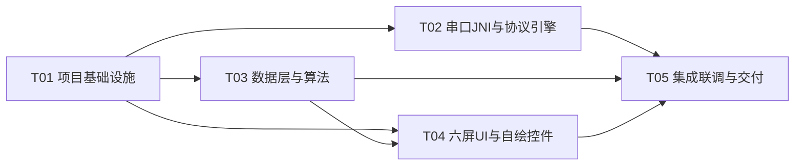

# EMRS-2B 物探仪器采集控制软件 —— Android 原生版架构设计与任务分解

| 项目 | 内容 |
|---|---|
| 文档版本 | v1.0 |
| 依据 | `docs/01-功能规格书.md`（v1.0）+ Delphi 基线源码 `caiyang_del(07-2-9)`（LX1~LX6.PAS/Lx.dpr/LX*.dfm）交叉验证 |
| 编写人 | 架构师（源码逐行核对后撰写） |
| 目标运行环境 | 自带原生串口的工控安卓设备（Android 7~11，7~10 寸横屏平板，/dev/ttyS* 等） |
| 构建方式 | 无外网本机写码；客户在装有 Android Studio 的电脑上离线/在线构建 |

> **交叉验证结论**：产品经理《功能规格书》与源码逐行核对基本一致，本设计以其为基线，并在 §8 增补架构师在源码核对中发现的、规格书未覆盖或需强调的实现细节/风险。下文凡“已核对”均表示我对照了 `LX*.PAS` 对应行。

---

## 0. 源码核对要点（架构师交叉验证记录）

我以 GBK 解码逐行阅读了 LX1~LX6.PAS、Lx.dpr、说明.txt，核对结果：

| 主题 | 结论 |
|---|---|
| 串口帧/应答 | 已核对：命令 01/02 为 6B `A0 A0 xx xx AF AF`；命令 03/04 为 8B 带异或校验；合法帧校验和 ∈ {0x00,0x80}；非 type=1 帧回 ACK `$A5`×16（每次 1 字节 write×16）；校验失败回 NAK `$AA`×1（LX1.PAS Comm1RxChar L386-626） |
| 帧尾截断语义 | 已核对：每帧处理完 `exit`，**同一 OnRxChar 内只处理一帧，尾帧之后的本批字节被丢弃**；帧体可跨多次 OnRxChar 用全局 `msg[]/msg_ii/have_head` 累积；若中途出现新 `A0 A0` 则重置 msg_ii（LX1 L407-631）。Android 移植见 §4.3 的取舍 |
| 等待应答扫描 | 已核对：`waiting_ack=true` 时只要收到 1 个 `$A5` 即认为 ACK，随后按“当前命令 send[3]”切换界面并启动看门狗 Timer4（LX1 L351-407） |
| 重发/看门狗 | 已核对：Timer3=3000ms 重发，命令 01/02/03 重发（6B/6B/8B），命令 04 不重发但同样计数到第 3 次才报“通信有故障！”（LX1 Timer3Timer L634-664）；Timer4 看门狗在 `data_come=false` 时显示“通信中断！”并停表（L694-709） |
| msg[1]=2 数据帧 | 已核对：250×2B v250hz → 4×2B 电流 → 1200×2B V2（各 prg 均 1200，只算前 points_end1）；重复 gdcs 帧 `goto same` 跳过解析；`msg[2]>gdcs+1` 报“数据有丢失！”（LX1 L466-618） |
| 电压/电流公式 | 已核对：VAB=`((h&3)*256+l)/1023*50`、电池=`…*50.45`、14 位补码 `xy=-(((x or 0xC000) xor 0xFFFF)+1)`、增益 `h&192` ∈ {0,/1, /128, /16384}；电流 `temp=((h&3)*256+l)/1023*100 * mddl/100 * 5/4`；非线性 `modify-=0.000068*modify²`；`iab_ave=trunc(modify*bl*100)/100`（LX1 L439-533） |
| 五点三次/替位/疏密 | 已核对：LX5.PAS smooth5_3 L157-223（毛刺剔除 0.6 阈值 + 分段五点三次，filter_bgn[1..5]=100,100,10,1,0.1，filter_no[2..5] 读自 lbcs 组合框、[1] 恒 1）、replace_ave L225-324、sparse_ave L326-343、normal_i L345-359 |
| 显示规整规则 | 已核对：测量模式（Timer3Timer L1097-1116）与标定模式（Timer2Timer L1006-1019）的保留位数阶梯**不同**，必须分别移植 |
| 数据文件 | 已核对：`.s/.n/.c/.dat`、`<xmbs><线号>.txt`、`bdxs.txt`、`zygs.txt`、`zyjg` 读、`gzcs.txt`（19 行顺序）与规格书 §5 一致；`.s` 第 2 行是 `trunc(average_i)`（整型），`.dat` 第 3 行 clsjv=30/61/93/126（prg1~4） |
| 关键差异点补充 | 见 §8.1：`>50V 目标电压编码回绕`、日期 `20`+2 位年拼接、Delphi real 默认文本格式、`v2value`/`v2` 数组越界读取依赖“全局数组初值 0”等 |

---

## 1. 总体方案与选型

### 1.1 一句话方案

**单 Activity + 六屏 View 切换 + 自研 JNI(C/termios) 串口驱动 + Handler 线程化协议状态机 + 纯 Kotlin 算法包 + 原格式(GBK+CRLF)文件读写**，功能与 lx.exe 1:1 复刻；无任何第三方运行时库（除 androidx 基础 4 件套）。

### 1.2 技术栈选型与理由

| 项 | 选择 | 理由 |
|---|---|---|
| 语言 | Kotlin 1.9.x + JDK 17（Android Studio Flamingo+ 自带） | 官方推荐、空安全利于协议/数组处理；构建在客户 AS 上完成 |
| UI | **View + XML**（不用 Compose） | 需求约束极简依赖；Compose 需要额外 compiler/runtime 依赖且对旧 AGP 配置要求高。View+XML 在 7~10 寸横屏固定比例缩放更直接可控 |
| AGP/Gradle | **AGP 7.4.2 + Gradle 7.6.4** | 稳定、兼容 Studio Giraffe/Hedgehog/Iguana；如需老 Studio（Dolphin）可降 Gradle 7.5，代码不变。**不**追求最新以避开离线缺件的风险 |
| compileSdk/targetSdk/minSdk | **compileSdk 33 / targetSdk 30 / minSdk 24** | 工控设备多为 Android 7~11：minSdk 24 覆盖 7.0+；targetSdk 30 避免 Android 11 分区存储强约束、避免 targetSdk≥31 的包可见性/前台服务限制；compileSdk 33 为当前各 AS 通用 |
| Gradle 依赖（全部） | `androidx.appcompat`、`com.google.android.material`、`androidx.constraintlayout`、`androidx.core:core-ktx` | 不用图表库（波形自绘）、不用数据库（文件即存储）、不用第三方串口库（JNI 自研）、不引 kotlinx-coroutines（用 Handler/线程，见 §4.4） |
| NDK/CMake | 项目 `ndkVersion 21.4.7075529`（若客户 SDK 无此版本可去掉该行用默认） | 仅编译自研 `serial_port.c`，ABI 只打包 `arm64-v8a`+`armeabi-v7a`（工控设备主流），可减小体积与构建时间 |
| 架构模式 | 单 Activity + **ScreenManager 视图切换**（六屏互斥显示，等价 Delphi hide/show）+ 全局单例 `AppState`（等价 lx1 全局变量）+ 服务单例（Serial/Protocol/Store） | 与 Delphi 的 6 Form + hide/show + 全局变量模型一一对应；避免多 Activity 间传参与进程重建丢状态 |
| 线程模型 | UI 主线程 + `ProtocolThread`(HandlerThread) + `SerialRxThread`(原生线程)，不使用协程依赖库 | 满足极简依赖；串口读→协议解析单线程化（等价 Delphi 单线程 OnRxChar），UI 事件 post 回主线程 |
| 横竖屏 | Manifest `android:screenOrientation="landscape"` | 原窗体全部横向布局；固定横屏同时避免旋转重建导致的协议/波形状态丢失 |

### 1.3 单 Activity vs 多 Activity 取舍

- **选单 Activity**。原因：
  1. 原程序是 6 个 Form 常驻 + hide/show，窗体间共享上百个“全局变量”与数组（v2value[32,3200]、biaoding、iab_ave…）；单 Activity 内一个 `AppState` 单例可 1:1 承载，避免跨 Activity 传递大数组；
  2. 串口会话/看门狗/协议累积缓冲（msg[] 最多 5000B）若随 Activity 销毁会丢状态；
  3. 六屏切换只是替换一个 FrameLayout 的内容，导航与原 hide/show 完全等价，且便于 Form2/Form5/Form6 共用底部状态栏与自绘控件。
- 返回键策略：六屏均注册“返回=原窗口『返回』按钮语义”（含数据未存盘守卫），主屏返回=退出确认。

### 1.4 与 11 条待确认问题的架构级应对（详表见 §8.2）

统一原则：**凡能做成配置开关的做成开关，默认值取“原代码字面行为”**，避免工程师为未决问题卡壳。

---

## 2. 工程结构与文件清单

### 2.1 工程根目录（Gradle 骨架）

```
emrs-android/
├─ settings.gradle                      # 仓库声明：google/mavenCentral；include ':app'
├─ build.gradle                         # 根脚本：AGP 版本、ext 常量
├─ gradle.properties                    # jvmargs、AndroidX=true
├─ gradle/wrapper/*                      # wrapper（工程内建议提供，客户 AS 也可自动生成）
├─ .gitignore
├─ docs/                                # 01-功能规格书.md / 02-架构设计.md(本文件)
│   ├─ class-diagram.mermaid
│   └─ sequence-diagram.mermaid
└─ app/
    ├─ build.gradle
    ├─ proguard-rules.pro
    └─ src/
        ├─ main/AndroidManifest.xml
        ├─ main/cpp/CMakeLists.txt
        ├─ main/cpp/serial/serial_port.h
        ├─ main/cpp/serial/serial_port.c
        ├─ main/java/com/qiangyuan/emrs/…
        ├─ main/res/…
        └─ test/java/com/qiangyuan/emrs/algo/…   # 纯算法单测（JUnit）
```

### 2.2 Java/Kotlin 完整文件清单（相对路径 + 职责一句话）

包根：`app/src/main/java/com/qiangyuan/emrs/`

**入口 / 核心（core）**

| 文件 | 职责 |
|---|---|
| `MainActivity.kt` | 唯一 Activity：横屏锁定、装载 ScreenManager、初始化 AppState/Serial/Protocol/Store、分发权限与串口错误提示 |
| `core/AppState.kt` | 全局“工作内存”单例（等价 lx1 全局变量）：prg_no/points 系列、v2value/v2/v2i/displ/biaoding/zhengyan/shjian/ruler_h/iab_ave/各标志位、grid 写指针、当前模式 bdcl、共享目录 wjljv、WorkParams 工作副本 |
| `core/StatusHub.kt` | 底部状态条消息总线：每屏“tishi”文本发布/订阅、Beep 请求、当前激活屏管理 |
| `core/Exec.kt` | 极简后台执行器：单后台 HandlerThread 做文件 IO/长任务，完成后 post 主线程（替代协程依赖） |

**serial 串口（JNI 接口 + 驱动）**

| 文件 | 职责 |
|---|---|
| `serial/SerialPortJni.kt` | `external fun` 声明 open/close/read/write/setBaud/listPorts，对应 JNI 符号（含 `System.loadLibrary("emrsserial")`） |
| `serial/serial_port.h/.c`（cpp 目录） | termios 原生实现：open(O_RDWR\|NOCTTY\|NONBLOCK)、tcgetattr 配置 8N1/校验/波特率表、原始模式、读写封装、`list_ports` 扫 `/dev/ttyS*/ttyUSB*/ttyMT*/ttyACM*`，返回 errno 字符串 |
| `serial/SerialPortConfig.kt` | data class（设备路径、波特率、数据位、校验、停止位）+ 默认 9600/8/N/1 + 常用路径清单 |
| `serial/SerialPortFinder.kt` | 枚举可读串口路径（JNI listPorts + 过滤），供设置页下拉 |
| `serial/RootHelper.kt` | root/系统权限检测与提权：检测 su、`su -c chmod 666 <dev>`、写透传错误；封装“不可用”原因给 UI |
| `serial/SerialPortManager.kt` | 打开/关闭生命周期、Rx 读线程（JNI read 循环 → 字节块回调）、下行写队列（synchronized 直写）、错误监听；实现 AutoCloseable |

**protocol 协议**

| 文件 | 职责 |
|---|---|
| `protocol/FrameCodec.kt` | 命令帧构造（C1/C2/C3/C4a/C4b 字节数组）、ACK/NAK 常量、校验异或；枚举 `EmrsCommand` |
| `protocol/RxFrameParser.kt` | 字节流状态机：跨块累计 `A0A0…AFAF` 帧、校验和 ∈{0,0x80} 判断、产出 payload；暴露 onValidFrame/onInvalidFrame 回调（解析器不直接回 ACK，由引擎决定） |
| `protocol/ProtocolSettings.kt` | 可配置项：ackEnabled、ackRepeatCount(默认16)、retryLimit(默认3)、resendMs(3000)、watchdogMs 表、strictOneFramePerChunk(默认 false) |
| `protocol/ProtocolEngine.kt` | 协议大脑：waiting_ack 状态、发命令→(ACK→界面切换/看门狗)、收帧→(type≠1 回 ACK/校验错回 NAK)、重发计时(postDelayed 3000)、看门狗计时、UI 事件回调；在 ProtocolThread 上单线程运行 |
| `protocol/EngineListener.kt` | UI 回调接口：onAck(cmd)、onStatusFrame(type,vab,batt)、onDataFrame(shot,rawResult)、onTimeout(cmd,resendOut)、onWatchdogTimeout()、onState(msg) |

**algo 算法（纯 Kotlin，全部可 JUnit 测试）**

| 文件 | 职责 |
|---|---|
| `algo/Decode.kt` | msg[1]=2 数据帧逐字节解析：14 位补码+增益归一到 ±1e7、v250hz[250]、电流 4 路换算与非线性校正、V2[1200] 减 v250hz 回绕去 50Hz、返回 `ShotData`（映射 LX1 L481-605） |
| `algo/DataModels.kt` | 传输模型：`ShotData(gdcs, v250hz:FloatArray, iabAve:Double, v2:DoubleArray)`、`ProcessOutput(displ,dLine,memoLines)` 等 |
| `algo/Smoothing.kt` | `fun smooth5_3(v2value:Array<DoubleArray>, iabAve:DoubleArray, times:Int, len:Int, filterNo:IntArray)` 毛刺剔除 + 分段五点三次（filter_bgn 内部表），**in-place 语义与源码一致** |
| `algo/ReplaceAve.kt` | `fun replaceAve(...): DoubleArray`（times==1 直拷；否则逐列 3σ 窗口→迭代收敛替位平均） |
| `algo/SparseAve.kt` | `fun sparseAve(v2, points): DoubleArray` 疏密平均成道 |
| `algo/Normalize.kt` | `fun normalize(v2i, averageI)` V2/I 归一 |
| `algo/Series.kt` | `data class ProgramSpec(points,pointsEnd,pointNo,clsjv)` + `specOf(prg)`、`computeTimesAndRuler(points,pointNo,imgW)`（shjian/ruler_h，trunc 规则同源码） |
| `algo/ProcessPipeline.kt` | 编排器：`runMeasure()`（Timer3Timer 语义）与 `runCalibration()`（Timer2Timer 语义），含两类**不同的**显示规整阶梯、biaoding=zhengyan/v2i、d1..d32/memo/曲线点输出 |
| `algo/Formatting.kt` | Delphi real 默认文本近似 + trunc/取位阶梯工具（详见 §5.8） |

**data 数据与文件（原格式兼容）**

| 文件 | 职责 |
|---|---|
| `data/WorkParams.kt` | 19 项工作参数数据类 + 每项含义/默认值/允许值（对应 gzcs 19 行）+ 校验 |
| `data/TextFileIO.kt` | GBK 编码 + CRLF 写行/读行、`DelphiRealWriter`（Delphi real 文本）、行尾归一化读（兼容旧文件 LF） |
| `data/GzcsStore.kt` | gzcs.txt 读（缺省→默认模板）/写（19 行 GBK+CRLF）；SharedPreferences 双写镜像 + 恢复优先级（文件→SP→默认） |
| `data/CalibrationStore.kt` | bdxs.txt 读（第 1 行 points+points 行 biaoding）/写 |
| `data/ProjectStore.kt` | 项目登记文件 `<xmbs><线号>.txt` 首行覆写/按点追加 |
| `data/ResultFiles.kt` | 测量成果四件套 `.s/.n/.c/.dat` 写出 + zygs.txt 生成 + zyjg 读（含文件名补零规则、每行格式，全部 GBK+CRLF） |
| `data/DataDirManager.kt` | 数据目录（默认 `getExternalFilesDir/emrs`）、建目录/列文件/删除；对外部可见路径适配 |
| `data/FileImport.kt` | SAF `ACTION_OPEN_DOCUMENT` 选择旧文件 → 复制字节到数据目录（保留原文件名） |
| `util/Gbk.kt` | GBK<->String 编码助手（String→GBK bytes / GBK bytes→String，回退 UTF-8/Latin1） |
| `util/ShareExport.kt` | FileProvider + `ACTION_SEND` / `ACTION_CREATE_DOCUMENT` 导出单个/全部成果文件（保持 GBK 字节不被转码） |
| `util/Beep.kt` | ToneGenerator 提示音 |
| `util/UiScale.kt` | Delphi 像素(设计 792×567) → 实际 dp/sp 缩放：`x(px)/y(px)/w/h/fs` |

**ui 六屏 + 自绘控件**

| 文件 | 职责 |
|---|---|
| `ui/ScreenManager.kt` | 六屏（含 P2 波形屏）注册/切换/返回栈；每个屏是一个根 View，Activity 只持一个容器 |
| `ui/common/StatusBarView.kt` | 底部状态条控件：tishi 文本、串口状态灯、时间/日期（订阅 StatusHub） |
| `ui/common/VBarMeter.kt` | 自绘电压条（对应 TrackBar1/2 只读显示）：0~120 档、0~60V 红刻度、数值 Edit 样式输出 |
| `ui/common/LogCurveView.kt` | 对数坐标曲线 View（Form5 数据页核心）：网格、log10(v*1e4)/9 映射 1e-4~1e5、正负/多条曲线颜色、双缓冲、无效值钳位；对外 API `draw(logCurves:List<Curve>, grid, xRuler:IntArray)` |
| `ui/common/WaveView.kt` | 250 点线性波形 View（Form4 调试屏，P2） |
| `ui/common/Grid8x4.kt` | 供电电流 8×4 表格控件控制器（等价 StringGrid2 单元格填入/复位） |
| `ui/main/MainScreen.kt` | Form1 主界面：标题区 + 自检/充电/设置/标定/测量/结束 6 大按钮 + 状态条 |
| `ui/selftest/SelfTestScreen.kt` | Form2 自检：电池电压、VAB 条、0~60V 刻度、返回（发命令 02×2） |
| `ui/setup/SetupScreen.kt` | Form3 设置：Tab0 图头（9 项）+ Tab1 参数（程序/供电次数/倍率/接收方式/滤波次数×4/满档电流）+ 生成正演格式 + 返回(写 gzcs+项目文件+ruler) |
| `ui/supply/SupplyScreen.kt` | Form5：Tab0 供电测量（Grid8x4 + 已供次数 + 供电开始 + 线/点号），Tab1 数据处理（LogCurveView + Panel2 信息 + d1..d32 + memo + 处理/存储/标定按钮 + 返回守卫） |
| `ui/charge/ChargeScreen.kt` | Form6 充电：设定 VAB（Edit+滑条 0~60V 联动）、实测 VAB 条、充电/退出（退出写 gzcs） |
| `ui/wave/WaveDebugScreen.kt` | Form4 波形显示（P2，隐藏入口）：读 hz50.txt 画 250 点 |

**资源 res**

| 文件 | 职责 |
|---|---|
| `res/layout/activity_main.xml` | 单容器 + 状态条占位 |
| `res/layout/screen_main.xml` `screen_selftest.xml` `screen_setup.xml` `screen_supply.xml` `screen_charge.xml` `screen_wave.xml` | 六屏布局（全部使用 UiScale 于代码或 ConstraintLayout 按比例） |
| `res/values/strings.xml` | 全部界面文案/状态提示（中文，含规格书状态语）；按钮/标签尺寸建议由 dimens 提供 |
| `res/values/colors.xml` `styles.xml` `dimens.xml` | 主题（横屏、无系统 ActionBar）、颜色（红/绿/蓝/黑/白/品红）、字号 |
| `res/xml/file_paths.xml` | FileProvider paths（数据目录） |
| `res/drawable/*.xml` | 圆角按钮/分隔线/背景等 |
| `res/mipmap-*/ic_launcher*.png` | 应用图标 |

> 预计 45 个左右 Kotlin/XML/C 文件，规模与“一屏一个根 View、状态集中于 AppState”的简单模型匹配。

---

## 3. 串口层设计

### 3.1 串口参数与可配置

- 默认：`/dev/ttyS0`（可改，列出 `/dev/ttyS*|ttyUSB*|ttyMT*|ttyACM*` 下拉）、波特率 9600、8/N/1、无流控 —— 与 Delphi TComm 默认及规格书 §4.1 一致；全部可在“系统/串口设置”（并入设置屏或独立小屏）修改并持久化到 SharedPreferences（不属于 gzcs 19 项）。
- 设置页提供“恢复出厂串口参数”。
- 说明：源码未显式设波特率，9600/8N1 是控件默认值（规格书问 1）；架构默认按 9600，预留波特率选项 1200~115200。

### 3.2 JNI C 设计（自研，参考 android-serialport-api 思路，不引第三方库）

`cpp/serial/serial_port.c`（NDK/CMake，产物 `libemrsserial.so`）函数清单：

| JNI 函数 | C 实现要点 |
|---|---|
| `open(String path, int baud, int dataBits, int parity, int stopBits)` | `open(path, O_RDWR|O_NOCTTY|O_NONBLOCK)`；`tcgetattr`→`cfmakeraw`→`cfsetispeed/ospeed`（波特率表，含 B9600…B115200；如需非标波特用 BOTHER+c_ispeed/c_ospeed）→ `c_cflag |= CLOCAL|CREAD`；dataBits=CS8/CS7；parity=NONE→`~(PARENB|INPCK)`、ODD→`PARENB|PARODD|INPCK`、EVEN→`PARENB|INPCK`；stopBits 1/2；`VMIN=0 VTIME=0`（非规范、非阻塞）；`tcflush(TCIOFLUSH)`；返回 fd（失败返回负 errno） |
| `close(int fd)` | `tcsetattr` 恢复 + `close` |
| `read(int fd, byte[] buf, int len)` | `read` 返回 n≥0；EAGAIN 返回 0 由 Java 层 sleep 重试 |
| `write(int fd, byte[] buf, int len)` | 循环写直至写完或出错；带 `tcflush(TCIFLUSH)` 前可选项 |
| `listPorts()` | 扫描 `/dev/ttyS{0..63}` `/dev/ttyUSB*` `/dev/ttyMT*` `/dev/ttyACM*`，返回可达路径数组 |
| 错误串 | 每个失败点返回/记录 `errno` 字符串供 UI |

- `CMakeLists.txt`：`add_library(emrsserial SHARED serial_port.c)`；`app/build.gradle` 配 `externalNativeBuild`、`ndk { abiFilters 'arm64-v8a','armeabi-v7a' }`。
- JNI Kotlin 声明（`SerialPortJni.kt`）：
```kotlin
object SerialPortJni {
    init { System.loadLibrary("emrsserial") }
    external fun open(path: String, baud: Int, dataBits: Int, parity: Int, stopBits: Int): Int
    external fun close(fd: Int)
    external fun read(fd: Int, buf: ByteArray, len: Int): Int
    external fun write(fd: Int, buf: ByteArray, len: Int): Int
    external fun listPorts(): Array<String>
}
```

### 3.3 Rx 读线程与字节缓冲

```
SerialRxThread(loop):
  while running:
    n = SerialPortJni.read(fd, buf, 4096)
    if n>0  → protocolEngine.onRxBytes(buf.copyOf(n))   // 只投递，不在读线程解析
    else    → sleep(10ms)                               // EAGAIN/超时
  关闭时 → 通知引擎 watchdog 停止
```

- 读线程只做“读→投递”；协议解析在 `ProtocolThread`（单线程）中做，天然避免并发状态。
- 帧切分与跨事件累积完全由 `RxFrameParser` 完成（§4.3）。

### 3.4 下行写队列与命令时序

- 命令都短（≤8B）。`SerialPortManager.write()` 内 synchronized 直接 JNI write（一次写完）；不存在与后台大数据上传冲突的场景（仪器不主动上传，均为应答型）。
- 时序控制在 `ProtocolEngine`（等 ACK、3000ms 重发、不并发下一条），因此没有独立“写队列”压力。保留一个容量 1 的“发送中”位（waitingAck 即互斥）。

### 3.5 权限：root / 系统签名 / 厂商提权

工控安卓 /dev/ttyS* 默认权限可能是 `660 root:root`，普通 App 打不开。按优先级：

1. **厂商系统签名（首选，正式交付）**：设备厂商把 App 加为系统应用（`/system/priv-app`）或用平台 key 签名，天然获得串口读写；文档在 README/交付说明写明。
2. **root 提权（现场调试/一般交付）**：`RootHelper`：
   - 检测：`Runtime.exec("which su")`/`su -c id` 判断可用；
   - 提权：打开前执行 `su -c "chmod 666 <dev>"`（每次会话执行，设备重启后需重跑），成功后再 JNI open；
   - 失败原因分三类展示：无 su / su 拒绝 / chmod 失败但可读。
3. **不 root 也不系统签名的兜底**：UI 显示“串口不可用：请以 root 执行 `chmod 666 /dev/ttySx`，或将本应用安装为系统应用”，不崩溃、允许继续使用设置/标定文件等功能。
- 打开失败/中途断开：状态条置红、弹错误、可重试，串口状态由 `StatusBarView` 实时显示。

---

## 4. 协议与状态机

### 4.1 命令对象（FrameCodec）

```kotlin
enum class EmrsCommand(val b:Int, val len:Int, val resendable:Boolean) {
    SELF_TEST(1,6,true),        // A0 A0 01 01 AF AF
    SELF_TEST_STOP(2,6,true),   // A0 A0 02 02 AF AF（Form2返回时连发 2 次，由调用方控制）
    SUPPLY(3,8,true),           // A0 A0 03 03 N N AF AF，N=供电次数, send[4]=3 恒为内程序3
    CHARGE_ENTER(4,8,false),    // A0 A0 04 00 04 AF AF
    CHARGE(4,8,false)           // A0 A0 04 H L (04^H^L) AF AF，H/L 目标 VAB 10 位编码
}
fun supplyFrame(times:Int):ByteArray      // 校验=3^3^times=times
fun chargeFrame(targetVab:Int):ByteArray  // sheding=trunc(vab/50*1023); H=(d/256)&3; L=d%256; 校验=4^H^L
```
- ACK：`$A5` 重复 `ackRepeatCount` 次（默认 16）；NAK：`$AA`×1。发送整包一次 16B，也保留 `ackPerByte=true` 模式（1B×16 次写）作为配置。

### 4.2 下行状态机（ProtocolEngine，全部在 ProtocolThread）

```
状态: IDLE → WAIT_ACK(cmd, resendCount) → 测量中/自检中/充电中（看门狗）
send(cmd):
  waitingAck=true; resendCount=1; 记 pendingCmd
  write 帧; 调度 resend(postDelayed 3000)

onResendTick():            // Timer3 语义
  resendCount++
  if resendCount>3(=第3次后):  // 对应 Delphi resend_count>=3
     按 pendingCmd 提示“通信有故障！”/命令02回主屏“未收到采样机应答！”
  else:
     if cmd.resendable  → 重写帧; waitingAck=true
     // cmd=4 不重发，但保留等待，下次 tick 仍计数，第3次后报故障
     重新调度 3000ms

onRxBytes(chunk):          // Timer3/4 的取消与调度都在 ProtocolThread
  if waitingAck && chunk.any{$A5} → onAckA5:
     取消 resend; waitingAck=false;
     when(pendingCmd.b) 4→进充电屏并启动看门狗6000 / 1→进自检屏+看门狗1000 / 2→回主屏 / 3→进测量态+看门狗6000
  frameParser.feed(chunk)   // 无论是否收到 ACK 都继续组帧（与源码一致）
```

### 4.3 上行组帧状态机（RxFrameParser）

- 数据结构：内部 `msg = ByteArray(5000)`（全局累积缓冲）、`msgLen`、`haveHead`——忠实复刻源码“跨 OnRxChar 累积”。
- 算法（对应源码 L407-631，去掉了每回调仅一帧的 `exit` 丢弃语义，改为循环取完整帧）：

```
feed(chunk):
  for b in chunk:
    if haveHead:
       if b==$AF && last==$AF:        // 找到帧尾
           payload = msg[0..len-2]     // msg 存的是帧头后字节，含校验字节；帧尾不进入
           checksum = xor(payload)
           if checksum==0x00 || 0x80:
               if payload[0]!=1 → 引擎发 ACK
               emit ValidFrame(payload[0], payload[1..])
           else:
               if payload[0]!=1 → 引擎发 NAK
           reset(haveHead=false, len=0); continue   // 之后字节寻找下一个 A0A0
       if len<5000: msg[len++]=b; last=b
    else:
       if b==$A0 && prev==$A0:         // 找到帧头 A0A0，重置累积（源码在每批内找“最后一个”头）
           haveHead=true; len=0; last=$A0   // 当前 A0 作 last，下一字节进缓冲
       prev=b
```
- 严格 1:1 模式（`strictOneFramePerChunk=true`）：在“一帧处理完即停，丢弃同批后续字节”行为与源码一致，默认 `false`（稳健优先），二者都不影响字节级协议正确性，仅影响“一次回调多帧”场景——原 Win32 串口事件粒度很小，正常不会触发差异。
- 边界：`payload[0]==1` 的自检帧不回 ACK/NAK；type=4 充电状态帧与 type=2 数据帧都要回 ACK（源码如此）。
- type=1/4 短帧：VAB=`((p2&3)*256+p3)/1023*50`、电池=`((p4&3)*256+p5)/1023*50.45`；type=4 再判断 `vab>=目标` → “充电完毕 !”。
- type=2 数据帧：长度≈2915B，解码交给 `algo/Decode.kt`，产出 ShotData 后：`gdcs==msg[2]` 重复帧只做结束判定（源码 goto same）；`msg[2]>gdcs+1` 提示“数据有丢失！”；`gdcs==供电次数` → “供电完毕；可进行数据处理。”

### 4.4 线程模型与选型理由

```
UI 主线程 ── 按钮/UI 事件 → ProtocolEngine.send(...)      [post 到 ProtocolThread]
SerialRxThread → SerialPortManager → protocolEngine.onRxBytes(...) [post]
ProtocolThread(HandlerThread) ── 收帧/组帧/重发/看门狗/回 ACK ── 事件回调 post → UI 主线程
UI 主线程 ── 存储(小文件) 用 Exec.background(...)
```

- 选 **Handler/HandlerThread** 而非 kotlinx-coroutines：协议是典型“串行消息+定时器”模型，Handler.postDelayed 直接对应 Delphi TTimer(Timer3/Timer4)；零第三方依赖、无调度器泄漏面。
- 看门狗表（可配置，默认与源码一致）：自检 1000ms、测量 6000ms、充电 6000ms；每次收到有效帧（type1/2/4）置 `dataCame=true`；到点 `!dataCame` → 通知各屏“通信中断！”并停止本会话看门狗（源码 Timer4 语义）。自检期间每次 msg[1]=1 帧都会刷新 dataCame。
- 帧级 ACK 开关：`ProtocolSettings.ackEnabled`（默认 true）+ `ackRepeatCount=16` 作配置；把规格书“ACK $A5×16 帧级确认”的语义落成可调参数。

---

## 5. 数据与算法模块映射

### 5.1 gzcs.txt 19 项 → WorkParams（含默认值，读写均已核对源码）

| # | 字段 | 含义/控件 | gzcs 读回规则（源码） | 默认值 |
|---|---|---|---|---|
| 1 | `projectName` xmmc | 项目名称 | 非空即回填 | `青海湖` |
| 2 | `projectTag` xmbs | 项目标识（写第 1 字符） | 回填；**校验仅允许 1 个 ASCII 字母** | `q` |
| 3 | `lineNo` xianhao | 线号 | 回填 | `1` |
| 4 | `pointNo` dianhao | 点号 | 回填 | `0` |
| 5 | `loopSide` gongquan | 供圈边长(m) | 回填 | `100` |
| 6 | `coilArea` cequan | 接收面积/测圈 | 回填 | `100` |
| 7 | `operatorName` czy | 操作员姓名 | 回填 | `李小二` |
| 8 | `prgNo` | 程序编号(ComboBox1) | **读回后强制置 '1'**（源码 L198） | `1` |
| 9 | `supplyTimes` | 供电次数(ComboBox2) | 回填 | `1` |
| 10 | `targetVab` | 目标 VAB（Form6.Edit2） | 存入全局 tmpvab → Form6 初始化 | `30` |
| 11 | `workAreaNo` gqh | 工区号 | 回填 | `01` |
| 12 | `operatorCode` czydm | 操作员代码 | 回填 | `0001` |
| 13 | `ratio` bl | 倍率 | 回填 | `2` |
| 14 | `receiveMode` jsfs | 接收方式(中心/重叠) | 回填 | `中心` |
| 15 | `dataDir` wjlj | 数据目录 | 回填；Android 上显示沙箱目录 | 见 DataDirManager |
| 16 | `filterNo2` lbcs2 | 1E2 滤波次数(0..5) | 回填 | `5` |
| 17 | `filterNo3` lbcs3 | 1E1 滤波次数 | 回填 | `5` |
| 18 | `filterNo4` lbcs4 | 1E0 滤波次数 | 回填 | `5` |
| 19 | `filterNo5` lbcs5 | 1E-1 滤波次数 | 回填 | `5` |

- 下拉允许值：prg `1..4`；供电次数 `1,4,8,16,32`；倍率 `0.5,1,2,3,4,5,6`；接收方式 `中心,重叠`；滤波 `0..5`；满档电流 mddl `2000,4000,8000`（mddl 属表单量，不进 gzcs）。
- **双写方案**：① 正常流程与源码一致写 `gzcs.txt`（GBK+CRLF，数据目录，可在设置里“导出”给旧软件）；② 每次保存同时写 SharedPreferences（app-private key=字段名）作为崩溃恢复镜像。启动恢复顺序：先读 gzcs.txt（存在即回填）→ 不存在则读 SP → 都不存在用默认值并在首次进入设置/退出时创建 gzcs.txt（不崩溃，区别于原版 I/O 错误——问 11 的处理）。

### 5.2 bdxs.txt 标定库

- 写：标定完成（ProcessPipeline.runCalibration）→ 第 1 行 `points`，随后 points 行 `biaoding[dot]`（原样未规整值），存数据目录 `bdxs.txt`。
- 读：测量入口 → 第 1 行 points、随后 points 行 biaoding。
- Android 校验策略（保持 1:1 但防呆）：读入后**提示性**检查“文件 points(道数) 与当前 prg 应一致”，不一致给出可继续/取消选项（原版无检查，属于隐式风险 §8.1）。

### 5.3 成果文件字段布局（从源码逐行核实）

统一命名：`tag=form3.xmbs.text`、`L=xxh.text(线号)`、`P=ddh.text(点号)`。

**(a) `<tag>L s P.txt`**（LX5 L806-815）
```
线圈边长（m）: <gongquan>
供电电流（A）: <trunc(average_i)>            ← 整型截断
倍率: <bl>
<points_end1>个V2/I值（采样间隔80微秒）: 
<i>␣␣<v2[i]/average_i>                       ← i=1..points_end1，双空格分隔
```

**(b) `<tag>L n P.txt`**（L819-828）
```
2␣<points>␣<gongquan>␣<trunc(average_i)>␣<0|1>    ← jsfs=重叠→0，否则(中心)→1
[jsfs=中心] <cequan>                               ← 仅中心有
4␣0.02
倍率: ␣<bl>
<shjian[i]>␣<v2i[i]>                               ← i=1..points
```

**(c) `<tag>L c P.txt`**（L831-844）同 (b) 头部，末段行 `shjian[i]␣v2i[i]*biaoding[i]`。

**(d) `<P左补0到4>-<L左补0到3>.dat`**（L850-938）
```
1: <yy><mm><dd><gqh>␣<P原样>␣<L原样>␣<czydm>
2: 20<yy>␣<mm>␣<dd>␣<hh>␣<min>
3: 4␣<clsjv>␣<供电次数>␣<points>          clsjv=30/61/93/126 (prg 1..4)
4: <目标VAB>␣<gzdlv=trunc((average_i-0.000068*average_i²)*100)/100>
5: 0␣<倍率bl>␣<jsfsv=中心0/重叠1>
6: <gongquan>␣<cequan>
7: <prg_no>␣0
8..: <shjian[i]>␣<v2i[i]*biaoding[i]>
```
（日期取 2 位年份 yy，见 §8.1-D；时间/日期字段均左补 0 到 2 位）

**(e) 项目登记 `<tag>L.txt`**：首次线号变时覆写第 1 行 `xmmc`；每存一个点 Append 一行 `P`。

**(f) zygs.txt（Form3『生成正演格式』）**：行1 `2 points gongquan (重叠0|中心1)`；中心加一行 `cequan`；行 `4 0.02`；随后 points 行 `shjian[i]`。

**(g) zyjg 读（标定用）**：第 1 行道数（≠points 提示“道数不一致！”），随后 points 行 `shjian zhengyan`。

### 5.4 算法映射（函数签名 / 源码行 / 说明）

| 阶段 | Kotlin 签名 | 源码行 | 关键系数/规则 |
|---|---|---|---|
| 14 位补码+增益 | `fun scale14(h:Byte,l:Byte):Double` | LX1 L488-496/579-587 | `x=(h&63)*256+l`；`h&32≠0→x=((x\|0xC000)^0xFFFF)+1` 取负；`v=x/8191*1e7`；`h&192`：0→×1，192→/16384，否则 /128 |
| 电流换算 | `fun currentScale(h,l,mddl):Double` | LX1 L519-525 | `((h&3)*256+l)/1023*100 * mddl/100 * 5/4` |
| 帧→ShotData | `fun decodeDataFrame(p:ByteArray, mddl:Int, bl:Double):ShotData` | LX1 L481-605 | 250 点 v250hz（p3 起每 2B）；4 路电流求和平均→`trunc((m-0.000068m²)*bl*100)/100`；1200 点 V2（j50hz 从 2 起、>250 回 1）逐点减 v250hz |
| 毛刺剔除+五点三次 | `fun smooth5_3(a:Array<DoubleArray>, iab:DoubleArray, t:Int, n:Int, fn:IntArray)` | LX5 L157-223 | ① j=2..n-1：3 点中值型 `aaa=sum-min-max`，`abs(a[i,j]-aaa)>0.6*abs(aaa)→替换`；② k=1..5：`j` 自 15 起 `while a[i,j]/iab[i]>=filter_bgn[k] j++`；`n-bgin>=3 && fn[k]>0` 时重复 fn[k] 次：`v2[j]=(17a[i,j]+12(a[i,j-1]+a[i,j+1])-3(a[i,j-2]+a[i,j+2]))/35`（j=bgin..n-1），回写 j=bgin..n-2 |
| 替位平均 | `fun replaceAve(a, t:Int, n:Int):DoubleArray` | LX5 L225-324 | t==1 直拷；否则逐列 ave/std=`sqrt(sum/(t-1))`，留 `\|x-ave\|≤3σ`；k<2 直接 ave；迭代：最大偏差点若 `dlt>0.02*\|ave\|` 置为 ave 再算，直至收敛 |
| 疏密平均 | `fun sparseAve(v2:DoubleArray, points:Int):DoubleArray` | LX5 L326-343 | `v2i[1]=v2[1]`；i=2..points 时取累计 `k+1..k+i` 平均，总用点数=points_end |
| 归一 | `fun normalizeI(v2i, averageI)` | LX5 L345-359 | `averageI>0` 时全部除 averageI |
| 道时间/x 坐标 | `ProgramSpec` / `computeRuler()` | LX3 L87-129, LX5 L547-556 | prg=1..4 → points 22/28/34/40、points_end1 253/406/595/820、point_no 242.5/392.5/578.5/800.5；`shjian[i]=sum/i*0.08`；`ruler_h[i]=trunc((sum/i-1)*imgW/point_no)`（i=1 为 0） |
| 显示规整（测量） | `fun roundDisplayMeasure(v:Double):Double` | LX5 L1097-1116 | ≥1e6:trunc；≥1e5:trunc；≥1e4:×10/10；≥1e3:×100/100；≥100:×1000/1000；≥10:×1e4/1e4；否则 ×1e6/1e6；符号保留 |
| 显示规整（标定） | `fun roundDisplayCalib(v:Double):Double` | LX5 L1006-1019 | ≥1e4:trunc；≥1e3:×10/10；≥100:×100/100；≥10:×1000/1000；否则 ×1e5/1e5 |
| 标定系数 | `biaoding[dot]=zhengyan[dot]/v2i[dot]` | LX5 L1002 | 与测量规整阶梯不同，勿共用 |
| 曲线纵坐标 | `fun logY(v:Double,imgH:Int):Int` | LX5 L1066/1163 | `v<0` 取负画蓝/`clBlue`，`v≥0` 红/`clRed`；钳位 ≥1e6 为 1e6；`y=imgH-imgH*log10(v*1e4)/9` |

### 5.5 处理编排（ProcessPipeline）

```
runMeasure():   // = Timer3Timer
   smooth5_3 → replaceAve → sparseAve → normalizeI
   每 dot: displ=roundDisplayMeasure(sign(v2i)*|v2i|)；写 d 标签/memo("dot, displ")；累计曲线点(logY)
   状态: ke_sjcl=false; ke_cunpan=true; cppd=true; agnexit=false
   提示“数据处理完毕；若结果满意，可以存盘。”

runCalibration():  // = Timer2Timer
   同算法链 → biaoding[dot]=zhengyan[dot]/v2i[dot] → roundDisplayCalib 显示
   最后写 bdxs.txt；ke_cunpan=false; yibiaoding=true
   提示“标定系数计算完毕，且已存盘；现在，可以进行实际测量。”
```

### 5.6 文件编码与数值格式（兼容旧软件关键点）

- 文本文件统一 **GBK 编码 + CRLF**（`TextFileIO`），与 Windows ANSI 输出一致。
- `TextFileIO.DelphiRealWriter`：Delphi `Write` 对 real 默认 general 文本（最多 18 位有效数字、指数阈值 ~1e-4/1e16）。Android 端实现 `formatReal(d)` 采用同样启发式（整型化 trunc 输出为整数；|d|<1e-4 或 ≥1e16 用科学计数 `x.xxxx…E±xx`，其余按需定点、去尾 0），并把“与真实旧文件逐字节比对”列入验收（P1 导入回归，可调 `floatFormat` 策略）。
- 整数域字段（trunc/取整后）以整型字面量输出，与 Delphi `writeln(integer)` 一致。
- 中文标点（如“（m）”全角括号）逐字来自源码字符串，编码转换时不得“智能”改写。

### 5.7 数据目录与导入导出

- 目录：`getExternalFilesDir(null)/emrs/`（Android/data/… 外置私有区，Android 7~11 免权限）。UI“文件路径”字段显示该目录；允许改为其它 app 私有目录。
- 首启建目录；不存在时不崩溃（问 11）。
- 导入：SAF 选文件（含旧 Windows 生成的 *.txt/*.dat）→ 原字节复制入目录（文件名不变，UTF 转 GBK 只在必要时提示）。
- 导出：FileProvider 分享单文件 / `ACTION_CREATE_DOCUMENT` 全选另存；内容以 GBK 字节流写出，旧软件可直接打开（问 10 默认兼容）。

---

## 6. UI 映射

### 6.1 六屏导航与还原

| Delphi 窗体 | Android 屏 | 进入 | 返回动作 |
|---|---|---|---|
| Form1 主界面 | `MainScreen` | 启动/各屏返回 | 退出确认→finish |
| Form2 自检 | `SelfTestScreen` | 发命令01 ACK 后 | 发命令02(×2)→回主屏 |
| Form3 设置 | `SetupScreen` | 主屏“设置” | 写 gzcs/项目文件/算 ruler→回主屏 |
| Form5 供电测量/数据处理 | `SupplyScreen`（Tab0/Tab1） | 主屏“标定/测量”（预置模式 caption） | 未存盘守卫→回主屏 |
| Form6 充电 | `ChargeScreen` | 主屏“充电”(C4a) ACK 或 type4 帧 | 写 gzcs→回主屏 |
| Form4 波形 | `WaveDebugScreen` | 主屏隐藏按钮“显示波形”(P2 保留隐藏入口) | 回主屏 |

- 六屏切换 = ScreenManager.replace(screen)；每个屏复用底部 `StatusBarView`。
- 守卫：Form5 未存盘（cppd && !agnexit）时点“返回/线号/点号/供电开始”提示“数据尚未存盘!!!”+Beep 仅一次（置 agnexit），与原版一致。
- 模式字：标定模式隐藏线/点号编辑与 Button5(存盘)，Button2=“计算标定系数”；测量模式显示并改 caption。

### 6.2 触屏/尺寸适配（7~10 寸横屏）

- 原设计坐标 792×567 @96dpi。用 `UiScale` 按 `width/792` 与 `height/567` 取 min 比例缩放坐标与字号；字高可再乘 1.1~1.25 保证触屏可读。按钮按比例后仍不得小于 44dp 高。
- Manifest 锁 landscape；ContentView 根用 ConstraintLayout 等比约束。
- 字号建议：正文 ≥14sp、数值 ≥16sp、标题可用 24~40sp 但不要求复刻华文彩云/方正舒体等（缺失时用系统黑体/等线，可接受）。
- 触屏关键区：主屏六大按钮竖排改为一排 6 个等宽大按钮（文字“自检/充电/设置/标定/测量/结束”，含原“␣”空格语义）；Form2/Form6 底部放“返回/退出”，用大号按钮。

### 6.3 Form4 波形（P2）与 Form5 页面布局建议

- Form5 数据页底部：LogCurveView（图区）+ 右侧 Panel2 信息（供圈/测圈、点号/线号、平均电流）+ 图例；下方两行 **d1..d32 数字条**（原 Panel3 白底 16×2）与 **memo 清单** 原本设计期重叠，Android 采用**上下/左右并排布局，两者都保留**（内容一致），规避规格书问 7 的“设计期重叠”歧义，不影响数据。
- d1..d32 数值仅在有数据时更新；数据清空（进 Tab0/供电开始）时全部清空。
- Form2/Form6 的 0~60V 电压条用 `VBarMeter` 自绘：滑块位置 `trunc(v/60*120)`、刻度 0,10,…60、单位 V。

### 6.4 状态栏信息区

每屏底部状态条固定四段：**主提示(tishi 文本) | 串口状态(●红/绿 + 设备名) | 供电次数/总次数 | 日期时间**；主提示文本完全复刻源码字符串（见 strings.xml）。Beep 经 StatusHub。

---

## 7. 有序任务列表（交付工程师，共 5 个任务）

> 拆分原则：按“基础设施→并行功能竖切→集成”分 5 个可顺序/半并行任务，每任务 ≥3 文件，先 T01 再并行 T02/T03，T04 依赖 T01/T03，T05 总装。任务间依赖尽量少、接口以契约（EngineListener/AppState/WorkParams/TextFileIO）先行锁定，工程师按契约实现可“不回头问”。

### T01 项目基础设施与全局骨架（P0）

- **做什么**：Gradle/AGP/Manifest/主题资源全部就位；MainActivity 横屏单容器；ScreenManager、AppState、StatusHub、Exec、UiScale、Gbk、Beep、DataDirManager 建成并可跑空壳；三张 Mermaid 图所指的包结构建好。
- **产出文件**：`settings.gradle`、`build.gradle`、`gradle.properties`、`app/build.gradle`、`proguard-rules.pro`、`AndroidManifest.xml`、`res/values/{strings,colors,styles,dimens}.xml`、`res/layout/activity_main.xml`、`res/xml/file_paths.xml`、`MainActivity.kt`、`core/AppState.kt`、`core/StatusHub.kt`、`core/Exec.kt`、`ui/ScreenManager.kt`、`util/{Gbk,Beep,UiScale}.kt`、`data/DataDirManager.kt`（目录创建/列文件）。
- **依赖**：无。
- **验收点**：`./gradlew assembleDebug` 能出包（无逻辑代码也能装）；启动显示主屏空壳+状态条；目录创建成功；AppState 字段（prg 表常量）就绪。

### T02 串口 JNI 与协议引擎（P0）

- **做什么**：自研 C(termios) 驱动 + RootHelper 权限 + SerialPortManager Rx 线程 + FrameCodec/RxFrameParser/ProtocolEngine 完整状态机与回调；Decode.kt 与数据帧字节解析（供 T03 用）。
- **产出文件**：`cpp/CMakeLists.txt`、`cpp/serial/serial_port.h`、`cpp/serial/serial_port.c`、`serial/{SerialPortJni,SerialPortConfig,SerialPortFinder,RootHelper,SerialPortManager}.kt`、`protocol/{FrameCodec,RxFrameParser,ProtocolSettings,ProtocolEngine,EngineListener}.kt`、`algo/Decode.kt`、`algo/DataModels.kt`、`res/layout/…（串口错误弹窗，可并入通用）`
- **依赖**：T01。
- **验收点**：NDK 编出 libemrsserial.so；可在假设备/回环线验证 open/write/read；协议单元可对“拆包多块的 A0A0…AF AF”正确组帧与校验（JUnit 或临时桩）；EngineListener 事件齐全。无真实仪器时可先用回环/脚本回放帧联调。

### T03 数据层与算法纯函数（P0）

- **做什么**：WorkParams/gzcs 双写、bdxs、项目登记、四件套+zygs/zyjg、TextFileIO(GBK+CRLF+Delphi real 格式)、算法包全部纯函数 + 编排器 + 单测。
- **产出文件**：`data/{WorkParams,TextFileIO,GzcsStore,CalibrationStore,ProjectStore,ResultFiles,FileImport}.kt`、`util/ShareExport.kt`、`algo/{Smoothing,ReplaceAve,SparseAve,Normalize,Series,ProcessPipeline,Formatting}.kt`、`app/src/test/java/…/algo/*Test.kt`
- **依赖**：T01（可用 T02 的 Decode 契约，T02 未完成时可先用造数桩测算法）。
- **验收点**：用源码给出的公式手算样例验证 smooth/replace/sparse 输出与 Excel/独立实现一致；写出的 `.s/.n/.c/.dat` 与规格书逐字节模板一致（GBK+CRLF）；导入导出在真机可用。

### T04 六屏 UI 与自绘控件（P0/P2）

- **做什么**：六屏布局 + LogCurveView/VBarMeter/WaveView/Grid8x4/StatusBarView + 全部交互（守卫、Beep、Tab 切换、caption 模式化）+ strings 文案。
- **产出文件**：`res/layout/screen_{main,selftest,setup,supply,charge,wave}.xml`、`ui/main/MainScreen.kt`、`ui/selftest/SelfTestScreen.kt`、`ui/setup/SetupScreen.kt`、`ui/supply/SupplyScreen.kt`、`ui/charge/ChargeScreen.kt`、`ui/wave/WaveDebugScreen.kt`、`ui/common/{StatusBarView,VBarMeter,LogCurveView,WaveView,Grid8x4}.kt`、`res/values/strings.xml`（全量中文文案）
- **依赖**：T01、T03（状态字段/文件接口）。可并行于 T02；接引擎仅在契约级联调。
- **验收点**：六屏真机横屏显示、字号/按钮触屏可点、Tab0/Tab1 切换与守卫提示、d1..d32 与 memo 并排显示、曲线 View 可画正弦样例并正确对数量程。

### T05 集成联调与交付打包（P0）

- **做什么**：ScreenManager 与 ProtocolEngine 事件接线（ACK→屏切换/看门狗/状态语）、串口设置入口、导入导出/分享收尾、错误提示与重试、README 构建/交付说明（含系统签名与 root 提权指引）、全链路自检走查。
- **产出文件**：`MainActivity.kt`(接线收口)、`ui/setup/SetupScreen.kt`(串口设置 Tab/对话框)、`README.md`、`docs/交付说明.md`（厂商签名+root chmod 步骤）、修正 T01-T04 中联调发现的细节。
- **依赖**：T02、T03、T04。
- **验收点**：假仪器（串口回环脚本/模拟应答盒）完整跑通：设置→自检→充电→标定→测量→处理→存盘→返回；串口掉线时 3 次重发→“通信有故障！”、看门狗→“通信中断！”；成果文件在 Windows 下用旧软件可读（GBK+CRLF 校验）。

### 任务依赖图



---

## 8. 风险与假设

### 8.1 源码核对发现的补充差异点/风险（规格书未强调）

| # | 事项 | 源码证据 | 架构处理 |
|---|---|---|---|
| A | **目标 VAB>50V 编码回绕**：设定值 0~60V 但 10 位编码按 `/50*1023`，>50V 时 `H=(d/256)&3` 截断回绕，仪器会按回绕值解释 | LX6 L119-121 | **按原样复刻**（1:1 优先）；UI 保持 0~60V；README/交付说明向客户说明该原版行为（属硬件约定疑点，问 8/仪器侧确认），不擅自改 |
| B | **一帧一批丢弃语义** | LX1 L627 `exit` | 默认稳健模式（处理同批多帧），提供 strict 开关；协议字节行为不变，见 §4.3 |
| C | **数组越界读依赖全局 0 初值**（v2 滤波计算访问 j±2 超出 points_end1、replace 后用值） | LX5 L207-208 | 算法数组按 `3202/3200` 分配并 0 初始化，忠实复刻“越界读到 0”的效果而非抛异常 |
| D | **日期 2 位年**：`.dat` 第 1 行 gqbhv=yy+mm+dd+gqh、第 2 行 `20`+yy | LX5 L889-926 | 直接取 2 位年（不足补 0）并 `20` 拼接，不依赖系统区域短日期格式（原版依赖 Windows 短日期，属隐式区域相关） |
| E | **delimiter 拼接**：多处 `writeln(F,i,10000/…)` 无分隔符输出（假 zyjg 遗留） | LX4 L97 | P2 遗留不移植/保持原样 |
| F | **smooth5_3 除零**：`v2value[i,j]/iab_ave[i]` 当 iab_ave[i]=0 会无限 while | LX5 L201 | 加防御：`iab_ave[i]≤0` 时按 0 处理直接置 bgin_j=15（记录日志），避免死循环 |
| G | **标定后未标定可测量**：Form1.Button4 硬置 yibiaoding=true | LX1 L225 | 复刻；提供 `requireCalibrated` 配置开关（默认关）以满足问 6 |
| H | **delphi real 默认文本格式不可 100% 还原**（RTL 内部） | — | TextFileIO 提供近似格式 + `floatFormat` 策略，P1 用客户真实旧文件逐字节回归校准 |
| I | 重复 gdcs 帧与跳号 | LX1 L470-472 | 按源码：重复帧只做完成判定，跳号仅提示 |

### 8.2 规格书 11 条待确认问题的架构处理

| 问 | 架构处理 |
|---|---|
| 1 串口参数 | 全部做成**设置项**（路径/波特率/8N1…），默认 9600/8/N/1 + 常用路径枚举；不阻塞开发 |
| 2 主界面充电 C4a | 按源码原样：进入充电屏触发（目标 0V）；与 Form6 目标充电同命令不同参数，语义差异留给仪器确认，做成**注释+README** |
| 3 ACK 次数 | 做成 `ackRepeatCount=16` 与 `ackPerByte=true/false`（默认整包 16B），两模式可切 |
| 4 Panel3/Memo1 重叠 | UI 并排双显（见 §6.3），数据内容相同不丢信息；留 `showMemo/showDlabels` 开关 |
| 5 主标题缺字 | strings 集中管理，占位为源码 Caption；客户确认后仅改 strings 一处 |
| 6 未标定可测量 | 复刻 + `requireCalibrated` 配置（默认关） |
| 7 Form3 默认页 | 进入即切到“图头”并聚焦 xmmc（代码行为），Tab 可自由切换 |
| 8 mddl 5/4 系数 | 按源码原样（写死于 Decode.kt，常量注释出处），留待硬件确认 |
| 9 send[4]=3 固定 | 按源码固定 3；若客户证实为 prg 相关，仅改 FrameCodec.supplyFrame 一处并加开关 `supplyPrgByte`(默认3) |
| 10 导出 GBK | 默认 GBK+CRLF，全局开关（默认 GBK，可选 UTF-8 仅显示用） |
| 11 gzcs 缺失 | Android 不崩溃：文件→SP→默认模板三级恢复 + 首次进入自动创建（行为差异记录到交付说明） |

### 8.3 其它风险与预案

| 风险 | 预案 |
|---|---|
| root/权限不可用 | RootHelper 分级提示；交付说明含厂商系统签名步骤；UI 允许在无串口下完成设置/文件/导入导出功能 |
| 无真实仪器联调 | 提供 `docs/模拟应答脚本.md`（Python 或串口回环+脚本按协议回 ACK/type2 帧）；QA 用脚本走全链路 |
| 波特率实际不同 | 设置项快速切换；建议客户第一次开箱用“串口自测”逐档扫描（P2 可选） |
| 旧文件 GBK 乱码 | 导入时按扩展名默认 GBK，读行失败自动回退尝试；导出保持字节原样 |
| Android 分区/厂商差异 | 只用 getExternalFilesDir + SAF；不写根/公共目录，避免 targetSdk 相关权限问题 |
| 设备重建/断电 | gzcs SP 镜像 + 关键数据仅在存盘动作写入；供电过程不落中间文件（与原版一致） |

---

## 9. 类图（class diagram）

```mermaid
classDiagram
    class MainActivity {
        +onCreate()
        -initSerial()
        -initScreens()
    }
    class AppState {
        +Int prgNo
        +Int supplyTimes
        +Int points
        +Int pointsEnd1
        +Double pointNo
        +IntArray ruler_h
        +DoubleArray shjian
        +Array~DoubleArray~ v2value
        +DoubleArray v2, v2i, biaoding, displ, zhengyan, iabAve
        +Boolean keSjcl, keCunpan, cppd, agnexit, waitingAck
        +String mode /*bd|cl*/
        +WorkParams work
        +Double targetVab
        +fun resetSession()
    }
    class StatusHub {
        +subscribe(screen, observer)
        +postText(text)
        +beep()
    }
    class ScreenManager {
        +Map~String, View~ screens
        +show(screen)
        +back()
    }
    class WorkParams {
        +String projectName
        +String projectTag
        +String lineNo
        +String pointNo
        +String loopSide
        +String coilArea
        +String operatorName
        +Int prgNo
        +Int supplyTimes
        +String targetVab
        +String workAreaNo
        +String operatorCode
        +String ratio
        +String receiveMode
        +String dataDir
        +IntArray filterNo
    }
    class SerialPortJni {
        <<external>>
        +open(path,baud,data,parity,stop)$ Int
        +read(fd,buf,len)$ Int
        +write(fd,buf,len)$ Int
        +close(fd)$
        +listPorts()$ Array~String~
    }
    class SerialPortManager {
        -fd: Int
        -rxThread: Thread
        +open(config): Result
        +close()
        +write(bytes)
        -rxLoop()
    }
    class RootHelper {
        +isRootAvailable() Boolean
        +grantDevice(path) Boolean
    }
    class FrameCodec {
        +selfTestFrame()$ ByteArray
        +selfTestStopFrame()$ ByteArray
        +supplyFrame(times)$ ByteArray
        +chargeEnterFrame()$ ByteArray
        +chargeFrame(targetVab)$ ByteArray
        +ackFrame(repeat)$ ByteArray
        +nakFrame()$ ByteArray
    }
    class RxFrameParser {
        -msg: ByteArray
        -len: Int
        -haveHead: Boolean
        +feed(bytes, sink)
    }
    class ProtocolEngine {
        -handlerThread: HandlerThread
        +send(cmd)
        +onRxBytes(chunk)
        -onAck()
        -startWatchdog(ms)
        -scheduleResend()
        +listener: EngineListener
    }
    class EngineListener {
        <<interface>>
        +onAck(cmd)
        +onStatusFrame(type, vab, batt)
        +onShot(shot)
        +onSupplyFinished()
        +onComError(kind)
        +onWatchdogTimeout()
    }
    class Decode {
        +decodeDataFrame(payload, mddl, ratio)$ ShotData
        +scale14(h,l)$ Double
        +currentScale(h,l,mddl)$ Double
    }
    class ProcessPipeline {
        +runMeasure(state, params): ProcessOutput
        +runCalibration(state, params, zhengyan): ProcessOutput
    }
    class Smoothing {
        +smooth5_3(a, iab, times, len, filterNo)$
    }
    class ReplaceAve {
        +replaceAve(a, times, len)$ DoubleArray
    }
    class SparseAve {
        +sparseAve(v2, points)$ DoubleArray
    }
    class Normalize {
        +normalizeI(v2i, averageI)$
    }
    class Series {
        +specOf(prg)$ ProgramSpec
        +computeTimesAndRuler(spec, imgW)$ Pair~DoubleArray,IntArray~
    }
    class TextFileIO {
        +writeLinesGbk(path, lines)$
        +readLinesGbk(path)$ List~String~
        +formatDelphiReal(d)$ String
    }
    class GzcsStore {
        +load(state, prefs)$
        +save(state, dir)$
    }
    class CalibrationStore {
        +read(dir)$ Pair~Int,DoubleArray~
        +write(dir, points, coeffs)$
    }
    class ResultFiles {
        +saveMeasureResults(state, params, biaoding)$ List~String~
        +saveCalibration(state, params, biaoding)$
        +writeZygs(...)$
        +readZyjg(...)$ Pair~DoubleArray,DoubleArray~
    }
    class ProjectStore {
        +ensureProjectFile(state)$
        +appendPoint(state)$
    }
    class FileImport {
        +importFromSaf(uri)$
    }
    class ShareExport {
        +shareFile(path)$
    }

    MainActivity --> ScreenManager
    MainActivity --> AppState
    MainActivity --> ProtocolEngine
    MainActivity --> StatusHub
    ScreenManager --> StatusHub
    ProtocolEngine --> RxFrameParser
    ProtocolEngine --> FrameCodec
    ProtocolEngine ..|> EngineListener
    SerialPortManager --> SerialPortJni
    SerialPortManager --> RootHelper
    ProtocolEngine --> SerialPortManager
    ProtocolEngine --> Decode
    MainScreen ..|> EngineListener
    SupplyScreen ..|> EngineListener
    SelfTestScreen ..|> EngineListener
    ChargeScreen ..|> EngineListener
    ProcessPipeline --> Smoothing
    ProcessPipeline --> ReplaceAve
    ProcessPipeline --> SparseAve
    ProcessPipeline --> Normalize
    ProcessPipeline --> Series
    GzcsStore --> WorkParams
    GzcsStore --> TextFileIO
    ResultFiles --> TextFileIO
    ProjectStore --> TextFileIO
    CalibrationStore --> TextFileIO
    AppState --> WorkParams
    MainScreen --> AppState
    SetupScreen --> WorkParams
    SupplyScreen --> AppState
```



## 10. 关键时序（sequence diagram）

### 10.1 测量流程（供电→逐次数据帧→处理→存盘）

```mermaid
sequenceDiagram
    autonumber
    actor U as 操作员
    participant M as MainScreen
    participant S as SupplyScreen
    participant E as ProtocolEngine
    participant R as RxFrameParser
    participant P as ProcessPipeline
    participant F as ResultFiles
    participant I as 仪器

    U->>M: 点击“测量”
    M->>M: 读 bdxs.txt→biaoding[]; mode=cl; 准备 Form5
    M->>S: show 供电测量页(Tab0)
    U->>S: 点击“供电开始”
    S->>E: send(SUPPLY, supplyTimes)
    E->>I: write A0 A0 03 03 N N AF AF
    E-->>S: 状态“正在发命令...”
    I-->>E: ACK($A5×16)
    E->>S: onAck(3)→切测量态; 看门狗 6000ms
    loop 每次供电 gdcs=1..N
        I-->>E: 数据帧(≈2915B, 跨多块)
        E->>R: feed(chunk)
        R-->>E: onValidFrame(type=2)
        E->>E: type≠1→回 ACK($A5×16)
        E->>E: Decode→ShotData(gdcs,iabAve,v2[])
        E-->>S: onShot: 更新 Grid8x4/已供次数; msg[2]>gdcs+1→“数据有丢失！”
    end
    E-->>S: onSupplyFinished “供电完毕；可进行数据处理。”
    U->>S: 切 Tab1 → 点击“处理测量数据”
    S->>P: runMeasure()
    P-->>S: displ/d/memo/曲线
    S-->>U: 状态“数据处理完毕；若结果满意，可以存盘。”
    U->>S: 点击“存储处理结果”
    S->>F: saveMeasureResults()
    F-->>S: 写出 .s/.n/.c/.dat + 项目登记追加
    S-->>U: “数据存盘成功！...”
```

### 10.2 自检（命令01→状态帧刷新→命令02 返回）与看门狗

```mermaid
sequenceDiagram
    autonumber
    participant M as MainScreen
    participant T as SelfTestScreen
    participant E as ProtocolEngine
    participant I as 仪器
    U->>M: 点击“自检”
    M->>E: send(SELF_TEST)
    E->>I: A0 A0 01 01 AF AF
    I-->>E: ACK
    E->>T: onAck(1)→show; 看门狗 1000ms
    loop 周期状态帧
        I-->>E: type=1 帧(9B, 不回ACK)
        E-->>T: onStatusFrame(1, vab, battery)
        Note over E: dataCame=true 刷新看门狗
    end
    U->>T: 点击“返回”
    T->>E: send(SELF_TEST_STOP) 连续2次
    E->>I: A0 A0 02 02 AF AF (×2)
    I-->>E: ACK
    E->>M: onAck(2)→回主屏
    Note over E: 若3×3000ms 无 ACK→“未收到采样机应答！”回主屏
```

## 11. 交付物与构建说明（给最终交付）

- 代码目录：`emrs-android/`（T01-T05 全部落地后自包含，无外网脚本）；客户在有 Android Studio（Flamingo 或更新；含 NDK/CMake）的电脑打开即可构建。
- 构建：`gradlew :app:assembleDebug`（或 release）；如需系统签名，用厂商 platform key 与 `apksigner` 重签。
- 串口交付：README 写清 `/dev/ttyS*` 打开方式（系统签名优先，root `chmod 666` 兜底）。
- 模拟联调脚本与旧文件回归样例属 T05 范围，便于无仪器验收。

*（完）*
